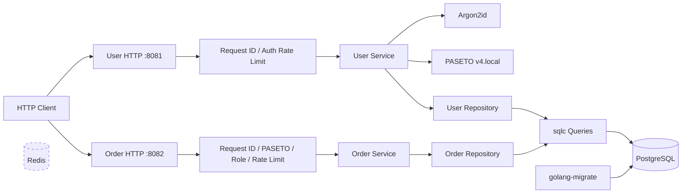
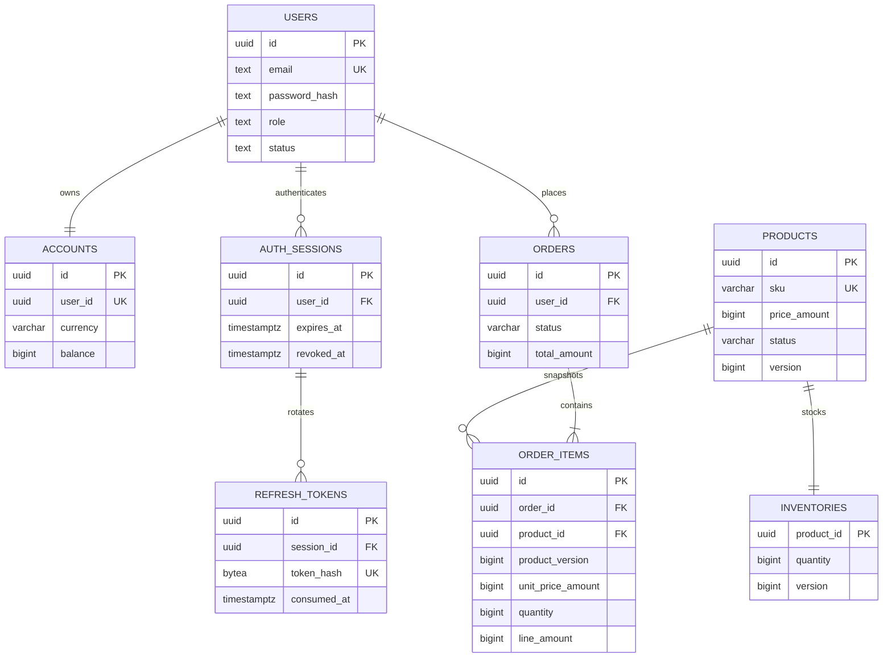

# Distributed Commerce Platform

A production-oriented Go microservice portfolio project built incrementally around transactional commerce workflows. The repository currently implements **Phase 3**: the service foundation, user authentication, product administration, inventory control, transactional order creation, customer/admin order history, and real PostgreSQL concurrency tests.

Payments, order state transitions, idempotency, gRPC, Redis application integration, asynchronous jobs, metrics, and tracing are intentionally not claimed as implemented yet.

## Current Status

Implemented:

- Environment-only configuration with startup validation and production PostgreSQL TLS enforcement
- JSON structured logging using `log/slog`
- PostgreSQL connection pooling with pgx/v5 and typed queries generated by sqlc
- Versioned, reversible migrations using `golang-migrate`
- Gin HTTP transport isolated from application and persistence logic
- User registration with an atomically created zero-balance account and auth session
- Argon2id password hashing with a PHC-formatted hash and bounded verification parameters
- Generic login failures and a dummy Argon2id verification for unknown users
- PASETO v4.local access tokens with required identity, role, issuer, audience, and time claims
- One-time opaque refresh tokens stored only as SHA-256 digests
- Transactional refresh rotation, concurrent-use protection, replay detection, and session-family revocation
- Bearer authentication and centralized role authorization middleware
- Request IDs, strict JSON decoding, 16 KiB body limits, and bounded per-IP auth rate limiting
- A separate `order-service` process that validates user-service PASETO access tokens
- Versioned product administration and active-only public catalog reads
- Atomic, versioned inventory adjustments without blind absolute overwrites
- Transactional multi-item order creation with deterministic locking and immutable product/price snapshots
- Customer-owned order history plus current-admin access to all orders
- Opaque keyset pagination for products, inventory, and orders
- Bounded commerce rate limiting by direct client IP or authenticated principal
- Loopback-only local HTTP and mandatory TLS 1.3 certificate configuration in production
- PostgreSQL-backed readiness, process liveness, and signal-aware graceful shutdown
- Rootless PostgreSQL and Redis infrastructure using Podman Quadlet and systemd user units
- Unit, HTTP, race, and real PostgreSQL integration tests

## Architecture



The dependency direction is:

```text
Gin transport -> domain service -> repository interface <- PostgreSQL implementation
```

Gin never enters a service or repository API. The user and order processes share the local PostgreSQL database and PASETO key but own separate composition roots, HTTP routes, readiness contracts, and domain packages. Redis runs as infrastructure but remains outside application behavior until Phase 6. PostgreSQL is the source of truth.

## Project Layout

```text
.
├── cmd/user-service/          # User/auth process composition
├── cmd/order-service/         # Product/inventory/order process composition
├── internal/auth/             # Argon2id, PASETO, refresh tokens, principal context
├── internal/user/             # Models, business rules, service, repository boundary
├── internal/order/            # Catalog, inventory, order rules and repository boundary
├── internal/config/           # Environment parsing and validation
├── internal/database/         # pgx pool, PostgreSQL repository, generated sqlc
├── internal/observability/    # slog construction
├── internal/platform/         # Shared HTTP TLS and graceful server lifecycle
├── internal/transport/http/   # Gin handlers and middleware
├── db/migrations/             # Ordered up/down migrations
├── db/query/                  # Reviewed SQL consumed by sqlc
├── deploy/quadlet/            # Rootless Podman systemd units
├── scripts/                   # Local secret initialization
├── Makefile
└── sqlc.yaml
```

## Tech Stack

| Area | Technology |
| --- | --- |
| Language | Go 1.26.5 |
| HTTP | Gin 1.12 |
| Access tokens | PASETO v4.local |
| Password hashing | Argon2id |
| Database | PostgreSQL 17 |
| Driver and pool | pgx/v5 |
| SQL generation | sqlc 1.31 |
| Migration | golang-migrate 4.18 |
| Local containers | Rootless Podman Quadlet |
| Future cache/queue infrastructure | Redis 7.4 |
| Logging | Standard library `log/slog` |
| Service manager | systemd user services |

## HTTP API

| Service | Method | Path | Authentication | Description |
| --- | --- | --- | --- | --- |
| User `:8081` | `POST` | `/v1/auth/register` | Public, rate limited | Register a customer and create an account/session |
| User `:8081` | `POST` | `/v1/auth/login` | Public, rate limited | Verify credentials and create a new session |
| User `:8081` | `POST` | `/v1/auth/refresh` | Refresh token, rate limited | Rotate a refresh token and issue a new token pair |
| User `:8081` | `POST` | `/v1/auth/logout` | Refresh token, rate limited | Revoke the refresh-token session family |
| User `:8081` | `GET` | `/v1/users/me` | Bearer access token | Return the authenticated user and account |
| Order `:8082` | `GET` | `/v1/products` | Public, rate limited | List active products with keyset pagination |
| Order `:8082` | `GET` | `/v1/products/:product_id` | Public, rate limited | Return one active product without exact stock |
| Order `:8082` | `POST` | `/v1/admin/products` | Current admin | Atomically create a product and inventory row |
| Order `:8082` | `GET` | `/v1/admin/products/:product_id` | Current admin | Return active or inactive product details |
| Order `:8082` | `PATCH` | `/v1/admin/products/:product_id` | Current admin | Version-checked product update |
| Order `:8082` | `GET` | `/v1/admin/inventory` | Current admin | List exact inventory quantities |
| Order `:8082` | `PATCH` | `/v1/admin/inventory/:product_id` | Current admin | Version-checked additive inventory adjustment |
| Order `:8082` | `POST` | `/v1/orders` | Current customer | Atomically create a pending order and deduct stock |
| Order `:8082` | `GET` | `/v1/orders` | Current customer/admin | Customer's orders or all orders for admins |
| Order `:8082` | `GET` | `/v1/orders/:order_id` | Current customer/admin | Owned order or any order for admins |
| Both | `GET` | `/healthz` | Public | Process liveness |
| Both | `GET` | `/readyz` | Public | Service-specific PostgreSQL/schema readiness |

Register:

```bash
curl --fail-with-body \
  -H 'Content-Type: application/json' \
  -d '{"email":"alice@example.com","password":"replace-this-password","display_name":"Alice"}' \
  http://127.0.0.1:8081/v1/auth/register
```

Use the returned access token:

```bash
curl --fail-with-body \
  -H "Authorization: Bearer ${ACCESS_TOKEN}" \
  http://127.0.0.1:8081/v1/users/me
```

Create an order after obtaining a product and its current `version`:

```bash
curl --fail-with-body \
  -H 'Content-Type: application/json' \
  -H "Authorization: Bearer ${ACCESS_TOKEN}" \
  -d '{"items":[{"product_id":"'"${PRODUCT_ID}"'","quantity":1,"expected_product_version":1}]}' \
  http://127.0.0.1:8082/v1/orders
```

Errors use one transport-owned envelope and never expose pgx, sqlc, Argon2id, or token parser details:

```json
{
  "error": {
    "code": "INVALID_CREDENTIALS",
    "message": "invalid email or password",
    "request_id": "bdac6153-2520-47db-ab5f-cf103effc72d"
  }
}
```

## Database Schema

The first three migrations create eight related business tables:



Database constraints additionally enforce canonical unique SKUs, bounded positive minor-unit prices, non-negative bounded inventory, valid product/order statuses, unique products per order, and exact `line_amount = unit_price_amount * quantity` using overflow-safe numeric comparison.

## Registration Transaction

Password hashing and token generation happen before opening the transaction. PostgreSQL then atomically performs:

```text
BEGIN
  INSERT user
  INSERT zero-balance account
  INSERT auth session
  INSERT initial refresh-token digest
COMMIT
```

A duplicate email rolls back every row. No account or session can survive a failed registration.

## Product And Order Transactions

Product creation checks the current database role and atomically inserts one product plus its one-to-one inventory row. Product updates require `expected_version`; inventory uses a nonzero additive `delta` plus its own `expected_version`. This prevents silent lost updates and avoids a stale absolute stock overwrite racing an order.

Order requests contain 1 to 50 unique products, each with quantity 1 to 1000 and the product version observed by the client. The service sorts UUIDs before entering this transaction:

```text
BEGIN
  verify the current user is an active customer and read account currency
  SELECT each product in UUID order FOR SHARE
  verify active status, version, currency, and calculate checked totals
  UPDATE each inventory row in UUID order
    SET quantity = quantity - requested, version = version + 1
    WHERE quantity >= requested
  INSERT pending order
  INSERT immutable order-item SKU/name/version/price snapshots
COMMIT
```

Every lock and statement has a PostgreSQL timeout, and the whole operation has a request-level database deadline. Missing stock, a stale product version, currency mismatch, timeout, or any later insert failure rolls back every earlier deduction. The public catalog exposes only `in_stock`/`out_of_stock`; exact quantities remain admin-only and advisory reads never replace transactional checks.

## Authentication Design

### Passwords

- Passwords are never trimmed, logged, or stored in plaintext.
- Registration accepts 12 to 128 bytes.
- Argon2id uses a unique 16-byte salt and a 32-byte key.
- Local defaults are 64 MiB memory, three iterations, and parallelism two.
- A nonblocking process-wide semaphore limits concurrent Argon2id work; saturation returns `503` rather than allocating more memory.
- Verification rejects malformed or excessive PHC parameters before allocating memory.
- Unknown-email login performs a dummy Argon2id comparison and returns the same error as a wrong password.

### Access Tokens

Access tokens are encrypted and authenticated PASETO v4.local tokens. Validation requires:

- `iss`, `aud`, `sub`, `jti`, `iat`, `nbf`, and `exp`
- `token_type=access`
- a known `customer` or `admin` role
- a UUID subject and token ID
- bounded lifetime and configured clock skew

The symmetric 32-byte key is generated under `.secrets/` for local development and injected only into the service process environment.

### Refresh Rotation

Refresh tokens use the form `rt1.<token-uuid>.<32-byte-random-secret>`. PostgreSQL stores only `SHA-256(raw_token)`.

Rotation uses this transaction:

```text
BEGIN
  SELECT refresh token + session FOR UPDATE
  sample PostgreSQL clock_timestamp after lock acquisition
  constant-time digest comparison
  validate session, user status, and absolute expiry
  mark current token consumed
  insert replacement token digest
COMMIT
```

The session lock serializes concurrent refresh attempts. One succeeds; a retry inside the short reuse grace is rejected without destroying the replacement. Reuse after the grace commits revocation of the whole session family before returning `401`.

Refresh rotation does not extend the session's absolute expiry. Request-level database deadlines and transaction-local PostgreSQL lock/statement timeouts bound contention. Once replay is confirmed, revocation uses a short independent context so a client disconnect cannot cancel the security side effect. Expired sessions are deleted in bounded batches, cascading to their token history.

## Authorization

Users have `customer` or `admin` roles. Self-registration always creates a `customer`; request payloads cannot select a role. Authentication puts a typed principal in `context.Context`, and role checks use centralized middleware rather than handler conditionals. Product/inventory mutations, order creation, and admin order reads also recheck the current database role/status instead of trusting only a possibly stale access-token role.

## Health Contract

`GET /healthz` is independent of PostgreSQL:

```json
{"status":"ok","service":"user-service"}
```

`GET /readyz` runs a deadline-bound sqlc query. User-service verifies the Phase 2 tables; order-service independently verifies products, inventories, orders, and order items. Database or schema failure returns `503` without exposing the driver error:

```json
{"status":"not_ready","service":"user-service","checks":{"postgres":"down"}}
```

## Local Development

### Prerequisites

- Go 1.26.5 or newer
- sqlc 1.31 or newer
- Podman 5.7 or newer with Quadlet support
- OpenSSL
- A working systemd user session

No Docker daemon, Docker CLI, or Docker Compose is used. Quadlet pulls PostgreSQL and Redis images through AWS Public ECR.

### Run

```bash
make init
make infra-up
make migrate-up
make run-user
```

In another terminal:

```bash
make run-order
```

`make init` creates `.env`, PostgreSQL/Redis credentials, a Redis ACL file, and a random PASETO key under `.secrets/`, all with owner-only permissions. These paths are ignored by Git. Rerunning it preserves existing random credentials and normalizes permissions.

`make infra-up` installs the Quadlets and waits for PostgreSQL and Redis health checks. Rootless `pasta` networking publishes ports only on loopback. User-service defaults to `127.0.0.1:8081`; `make run-order` overrides the second process to `127.0.0.1:8082`. Production mode refuses to start without a TLS certificate/key pair and serves TLS 1.3 directly.

The first migration command builds pinned `golang-migrate` `v4.18.3` into the ignored `bin/` directory. The Go toolchain honors the configured `GOPROXY`.

Stop local infrastructure:

```bash
make infra-down
```

## Configuration

| Variable | Required | Default | Purpose |
| --- | --- | --- | --- |
| `DATABASE_URL` | yes | none | PostgreSQL connection URL |
| `PASETO_V4_LOCAL_KEY` | yes | none | 32-byte hex v4.local key; injected by `make run-user` and `make run-order` |
| `APP_ENV` | no | `local` | `local`, `test`, or `production` |
| `SERVICE_NAME` | no | process-specific | Structured log and health response service name |
| `HTTP_ADDR` | no | user `:8081`, order `:8082` | Process-specific loopback listen address |
| `HTTP_TLS_CERT_FILE` | production | none | PEM certificate chain for native HTTPS |
| `HTTP_TLS_KEY_FILE` | production | none | PEM private key for native HTTPS |
| `ACCESS_TOKEN_TTL` | no | `15m` | Access-token lifetime |
| `REFRESH_TOKEN_TTL` | no | `168h` | Absolute session/refresh lifetime |
| `TOKEN_CLOCK_SKEW` | no | `30s` | Maximum accepted clock skew |
| `REFRESH_REUSE_GRACE` | no | `5s` | Concurrent refresh retry grace |
| `ARGON2_MEMORY_KIB` | no | `65536` | Argon2id memory cost |
| `ARGON2_ITERATIONS` | no | `3` | Argon2id time cost |
| `ARGON2_MAX_CONCURRENCY` | no | `2` | Process-wide concurrent Argon2id limit |
| `AUTH_RATE_LIMIT_RPS` | no | `2` | Auth requests per second per remote IP |
| `AUTH_RATE_LIMIT_BURST` | no | `5` | Auth token-bucket burst |
| `COMMERCE_RATE_LIMIT_RPS` | no | `20` | Catalog requests per IP or authenticated requests per principal per second |
| `COMMERCE_RATE_LIMIT_BURST` | no | `40` | Commerce token-bucket burst |
| `DB_MAX_CONNS` | no | `20` | pgx pool upper bound |
| `DB_MIN_IDLE_CONNS` | no | `2` | pgx idle connection lower bound |
| `DB_OPERATION_TIMEOUT` | no | `5s` | Maximum application database operation time |
| `DB_LOCK_TIMEOUT` | no | `2s` | PostgreSQL transaction lock wait limit |

All accepted ranges are checked before the service opens its listener. Production requires `sslmode=verify-full` in `DATABASE_URL`.

## Testing

```bash
make test
make test-race
make test-integration
make check
```

Coverage includes:

- Argon2id hashing, salts, verification, and hostile PHC strings
- PASETO claims, tampering, wrong keys, expiry, future issuance, and clock skew
- Refresh-token format, entropy, parsing, and digest behavior
- User validation, generic login failures, disabled accounts, and dummy verification
- Strict HTTP JSON/body limits, error mapping, request IDs, authentication, authorization, and rate limiting
- Real PostgreSQL registration rollback at early/late failures, constraints, refresh concurrency, lock timeout, replay revocation, and expiry cleanup
- Full register/login/me/refresh/logout HTTP flow against real PostgreSQL
- Product normalization, optimistic versions, inventory bounds, role checks, deterministic item ordering, and order validation
- Public/admin product DTO boundaries, strict cursors, JSON 404/405, duplicate-key rejection, and commerce error sanitization
- Real PostgreSQL product/inventory transactions, late order rollback, ownership, and immutable price snapshots
- A barrier-synchronized `N=20`, stock `1` overselling test that requires exactly one order and a final quantity of zero
- Opposing `[A,B]`/`[B,A]` concurrent orders and equal-timestamp multipage keyset tests
- Full admin-create/public-read/customer-order/history/restock API flow against real PostgreSQL and PASETO

CI and benchmark reporting are Phase 8 work. No performance data is invented.

## Design Decisions

- **PASETO access, opaque refresh:** access tokens are efficient and self-contained; refresh tokens need server-side revocation, rotation, and replay detection.
- **Absolute refresh sessions:** rotation never creates an indefinitely renewable session.
- **Database concurrency control:** refresh serialization uses PostgreSQL row locks, not a Go mutex, so it works across replicas.
- **Deterministic order locking:** product and inventory rows are acquired in sorted UUID order; atomic conditional updates are the final overselling guard.
- **Immutable order history:** names, SKUs, versions, unit prices, and line totals are copied into order items while product rows are locked.
- **Separate composition roots:** user and order APIs run as distinct processes while sharing narrowly scoped platform/auth/database packages.
- **No network calls in transactions:** password hashing and external operations remain outside database transactions.
- **Small interfaces at consumers:** the service owns its repository boundary; transport owns its service/token boundaries for focused tests.
- **No global mutable state:** configuration, keys, logger, pool, limiter, and services are constructed in `main`.
- **Strict transport boundary:** Gin parses HTTP and maps errors; business rules receive `context.Context` and domain requests.
- **Redis is not authoritative:** it is provisioned but unused by Phase 3 application code.

## Security Baseline

- `.env`, `.secrets/`, and generated binaries are excluded from Git.
- Database, Redis, and HTTP development ports bind to local configuration; infrastructure ports bind loopback.
- Passwords, bearer tokens, refresh tokens, and DSNs are never written to business logs.
- Refresh-token digests are compared in constant time.
- JSON rejects unknown fields, duplicate keys, and trailing values; request bodies are capped at 16 KiB.
- Gin does not trust forwarding proxies by default.
- Auth endpoints use a bounded LRU per-IP token bucket, an overflow bucket at capacity, and IPv6 `/64` aggregation.
- Commerce endpoints use the same bounded design, keyed by direct IP before authentication and principal UUID afterward.
- Logout and confirmed replay revocation use short independent deadlines so client cancellation cannot undo the security action.
- Database parse errors and HTTP errors are sanitized.
- Graceful shutdown restores default signal handling after the first termination signal.

## Roadmap

1. **Phase 1 complete:** runtime, PostgreSQL, migration, sqlc, logging, probes, Podman Quadlet.
2. **Phase 2 complete:** users, accounts, Argon2id, PASETO, refresh rotation, auth middleware, API/integration tests.
3. **Phase 3 complete:** products, inventory, transactional order creation/history, and overselling concurrency tests.
4. **Phase 4:** account debit, payment transactions, order state changes, and idempotency.
5. **Phase 5:** protobuf contracts and deadline-bound gRPC communication.
6. **Phase 6:** Redis product cache, Asynq jobs, retries, and failed task handling.
7. **Phase 7:** Prometheus metrics and OpenTelemetry traces.
8. **Phase 8:** production images, Kubernetes, OpenAPI, CI, benchmarks, and final portfolio documentation.

## Known Limitations

- Stateless access tokens cannot be individually revoked; exposure is bounded by the access-token TTL.
- Role/status changes can remain visible in an existing access token until it expires; refresh reads current database state.
- Auth and commerce rate limiters are process-local. Distributed enforcement belongs at ingress or in a later Redis-backed implementation.
- Order creation has no idempotency key yet. An ambiguous client retry can create a second order; exactly-once behavior is not claimed before Phase 4.
- Pending orders permanently consume inventory in Phase 3; cancellation, payment failure, expiry, and compensating restock arrive with later workflows.
- User-service and order-service currently share one PostgreSQL database, so schema ownership is separated in code rather than by database credentials/schema.
- PASETO v4.local requires both services to share symmetric verification authority; asymmetric service verification is deferred to a later trust-boundary revision.
- Email verification, password reset, MFA, account deletion, and audit history are not implemented.
- Redis is provisioned but not consumed by application code yet.
- The local PostgreSQL bootstrap role owns the development database; separate production migrator/runtime roles arrive with production deployment work.
- Metrics and tracing are not represented as completed features.
