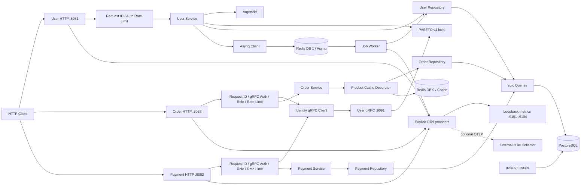
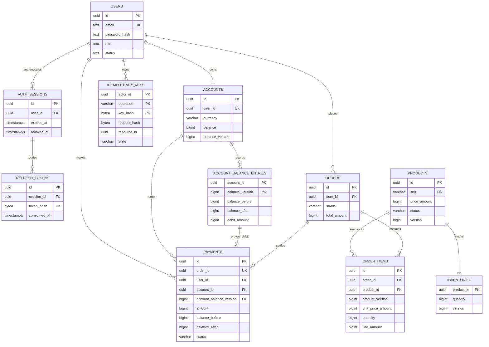

# Distributed Commerce Platform

A production-oriented Go microservice portfolio project built incrementally around transactional commerce workflows. The repository currently implements **Phase 8**: the service foundation, transactional commerce workflows, centralized gRPC identity, Redis caching, retrying Asynq jobs, Prometheus metrics, OpenTelemetry traces, production OCI images, Kubernetes manifests, an OpenAPI contract, CI gates, and reproducible benchmark entry points.

External payment providers, refunds, cancellation/restock workflows, transactional outbox delivery, hosted observability backends, dashboards, and alerting are intentionally not claimed as implemented yet.

## Current Status

Implemented:

- Environment-only configuration with startup validation and production PostgreSQL TLS enforcement
- JSON structured logging using `log/slog`
- PostgreSQL connection pooling with pgx/v5 and typed queries generated by sqlc
- Versioned, reversible migrations using `golang-migrate`
- Gin HTTP transport isolated from application and persistence logic
- User registration with an atomically created zero-balance account and auth session
- Argon2id password hashing with a PHC-formatted hash and bounded verification parameters
- Generic login failures and a dummy Argon2id verification for unknown users
- PASETO v4.local access tokens with required identity, role, issuer, audience, and time claims
- One-time opaque refresh tokens stored only as SHA-256 digests
- Transactional refresh rotation, concurrent-use protection, replay detection, and session-family revocation
- Bearer authentication and centralized role authorization middleware
- Request IDs, strict JSON decoding, 16 KiB body limits, and bounded per-IP auth rate limiting
- A separate `order-service` process that validates access tokens through user-service gRPC
- Versioned product administration and active-only public catalog reads
- Atomic, versioned inventory adjustments without blind absolute overwrites
- Transactional multi-item order creation with deterministic locking and immutable product/price snapshots
- Customer-owned order history plus current-admin access to all orders
- Opaque keyset pagination for products, inventory, and orders
- Bounded commerce rate limiting by direct client IP or authenticated principal
- Mandatory request-hashed `Idempotency-Key` handling for order and payment creation
- A separate `payment-service` process with owned-payment reads and current-admin reads
- Atomic account debit, succeeded payment insert, and `pending -> paid` order transition
- Commit-outcome resolution that never automatically reruns an ambiguous debit
- Versioned `identity.v1` protobuf contract with generated Go and gRPC stubs
- Deadline-bound identity gRPC client with no configured retries and sanitized `401`/`503` mapping
- User-service HTTP and gRPC dual-listener lifecycle with standard gRPC health and bounded drain
- Loopback-only local gRPC plus production TLS 1.3 mTLS and SPIFFE URI client allowlisting
- PASETO key isolation: only user-service can load the symmetric key
- Loopback-only local HTTP and mandatory TLS 1.3 certificate configuration in production
- Cache-aside public product detail reads with PostgreSQL fallback, TTL, generation-fenced fill, and post-write invalidation
- A separate Asynq worker for bounded expired-session cleanup with uniqueness, retries, archive handling, and single-task recovery tooling
- Process-owned Redis configuration, loopback-only plaintext, and verified TLS support in production
- Per-process Prometheus registries with isolated loopback-only `/metrics` listeners
- Explicit OpenTelemetry instrumentation for Gin, gRPC, pgx, Redis, and Asynq with optional OTLP/gRPC export
- Trace-context propagation across HTTP, identity RPC, database/cache calls, and delayed jobs plus log correlation
- Digest-pinned static OCI images for API services, worker, admin CLI, and embedded migration runner
- Kustomize base/production deployment contract with non-root security contexts, probes, PDBs, and migration Job
- OpenAPI 3.1 HTTP contract validated against the concrete route set
- GitHub Actions quality, integration, image, vulnerability, and informational benchmark jobs
- Architecture, operations, and threat-oriented security documentation under `docs/`
- PostgreSQL-backed readiness, process liveness, and signal-aware graceful shutdown
- Rootless PostgreSQL and Redis infrastructure using Podman Quadlet and systemd user units
- Unit, HTTP, race, and real PostgreSQL/Redis integration tests

## Architecture



The dependency direction is:

```text
Gin transport -> domain service -> repository interface <- PostgreSQL implementation
```

Gin and gRPC remain transport adapters around typed boundaries. The three API processes share PostgreSQL for the Phase 4 monetary transaction, but only user-service receives the PASETO key. Order/payment authenticate through user-service before entering domain code, then recheck current role/status in PostgreSQL. No RPC, Redis call, or task enqueue occurs inside a database transaction. Cache failures fall back to PostgreSQL; queue enqueue failures cannot reverse committed authentication work.

## Project Layout

```text
.
├── cmd/user-service/          # User/auth process composition
├── cmd/order-service/         # Product/inventory/order process composition
├── cmd/payment-service/       # Account debit/payment process composition
├── cmd/job-worker/            # Asynq maintenance worker composition
├── cmd/job-admin/             # Restricted archived-task operations
├── cmd/migrator/              # One-shot embedded migration runner
├── cmd/loopback-probe/        # Minimal worker container probe
├── internal/auth/             # Argon2id, PASETO, refresh tokens, principal context
├── internal/user/             # Models, business rules, service, repository boundary
├── internal/order/            # Catalog, inventory, order rules and repository boundary
├── internal/payment/          # Payment rules and repository boundary
├── internal/idempotency/      # Key validation and canonical request hashing
├── internal/identity/         # Deadline-bound identity gRPC client
├── internal/jobs/             # Versioned task client, handlers, retries, logging
├── internal/productcache/     # Generation-fenced Redis repository decorator
├── internal/redisclient/      # Bounded Redis client and TLS construction
├── internal/genproto/         # Committed generated protobuf/gRPC Go code
├── internal/config/           # Environment parsing and validation
├── internal/database/         # pgx pool, PostgreSQL repository, generated sqlc
├── internal/observability/    # slog correlation, Prometheus registry, OTel providers
├── internal/platform/         # HTTP/gRPC/metrics lifecycle and process orchestration
├── internal/transport/grpc/   # Handwritten identity gRPC adapter
├── internal/transport/http/   # Gin handlers and middleware
├── api/proto/identity/v1/     # Versioned identity service contract
├── api/openapi/               # Validated HTTP API contract
├── db/migrations/             # Ordered up/down migrations
├── db/query/                  # Reviewed SQL consumed by sqlc
├── deploy/quadlet/            # Rootless Podman systemd units
├── deploy/kubernetes/         # Kustomize production deployment contract
├── docs/                      # Architecture, operations, and security runbooks
├── Containerfile              # Reproducible static OCI image build
├── .github/workflows/         # CI and artifact pipeline
├── scripts/                   # Local secrets, generated-code checks, test DB safety
├── Makefile
├── buf.yaml
├── buf.gen.yaml
└── sqlc.yaml
```

## Tech Stack

| Area | Technology |
| --- | --- |
| Language | Go 1.26.6 |
| HTTP | Gin 1.12 |
| RPC | gRPC-Go 1.83 |
| Contracts | Protocol Buffers 3, Buf 1.72 |
| Access tokens | PASETO v4.local |
| Password hashing | Argon2id |
| Database | PostgreSQL 17 |
| Driver and pool | pgx/v5 |
| SQL generation | sqlc 1.31 |
| Migration | golang-migrate 4.18 |
| Local containers | Rootless Podman Quadlet |
| Cache and queue | Redis 7.4, go-redis 9.22, Asynq 0.26 |
| Logging | Standard library `log/slog` |
| Metrics and traces | Prometheus client 1.24, OpenTelemetry 1.45/contrib 0.70, OTLP/gRPC |
| Service manager | systemd user services |

## HTTP API

| Service | Method | Path | Authentication | Description |
| --- | --- | --- | --- | --- |
| User `:8081` | `POST` | `/v1/auth/register` | Public, rate limited | Register a customer and create an account/session |
| User `:8081` | `POST` | `/v1/auth/login` | Public, rate limited | Verify credentials and create a new session |
| User `:8081` | `POST` | `/v1/auth/refresh` | Refresh token, rate limited | Rotate a refresh token and issue a new token pair |
| User `:8081` | `POST` | `/v1/auth/logout` | Refresh token, rate limited | Revoke the refresh-token session family |
| User `:8081` | `GET` | `/v1/users/me` | Bearer access token | Return the authenticated user and account |
| Order `:8082` | `GET` | `/v1/products` | Public, rate limited | List active products with keyset pagination |
| Order `:8082` | `GET` | `/v1/products/:product_id` | Public, rate limited | Return one active product without exact stock |
| Order `:8082` | `POST` | `/v1/admin/products` | Current admin | Atomically create a product and inventory row |
| Order `:8082` | `GET` | `/v1/admin/products/:product_id` | Current admin | Return active or inactive product details |
| Order `:8082` | `PATCH` | `/v1/admin/products/:product_id` | Current admin | Version-checked product update |
| Order `:8082` | `GET` | `/v1/admin/inventory` | Current admin | List exact inventory quantities |
| Order `:8082` | `PATCH` | `/v1/admin/inventory/:product_id` | Current admin | Version-checked additive inventory adjustment |
| Order `:8082` | `POST` | `/v1/orders` | Current customer + idempotency key | Atomically create a pending order and deduct stock |
| Order `:8082` | `GET` | `/v1/orders` | Current customer/admin | Customer's orders or all orders for admins |
| Order `:8082` | `GET` | `/v1/orders/:order_id` | Current customer/admin | Owned order or any order for admins |
| Payment `:8083` | `POST` | `/v1/payments` | Current customer + idempotency key | Debit account, record payment, and mark order paid |
| Payment `:8083` | `GET` | `/v1/payments/:payment_id` | Current customer/admin | Owned payment or any payment for admins |
| All | `GET` | `/healthz` | Public | Process liveness |
| All | `GET` | `/readyz` | Public | Service-specific PostgreSQL/schema readiness |

Register:

```bash
curl --fail-with-body \
  -H 'Content-Type: application/json' \
  -d '{"email":"alice@example.com","password":"replace-this-password","display_name":"Alice"}' \
  http://127.0.0.1:8081/v1/auth/register
```

Use the returned access token:

```bash
curl --fail-with-body \
  -H "Authorization: Bearer ${ACCESS_TOKEN}" \
  http://127.0.0.1:8081/v1/users/me
```

Create an order after obtaining a product and its current `version`:

```bash
curl --fail-with-body \
  -H 'Content-Type: application/json' \
  -H "Authorization: Bearer ${ACCESS_TOKEN}" \
  -H "Idempotency-Key: ${ORDER_IDEMPOTENCY_KEY}" \
  -d '{"items":[{"product_id":"'"${PRODUCT_ID}"'","quantity":1,"expected_product_version":1}]}' \
  http://127.0.0.1:8082/v1/orders
```

Pay a pending order from the customer's internal account balance:

```bash
curl --fail-with-body \
  -H 'Content-Type: application/json' \
  -H "Authorization: Bearer ${ACCESS_TOKEN}" \
  -H "Idempotency-Key: ${PAYMENT_IDEMPOTENCY_KEY}" \
  -d '{"order_id":"'"${ORDER_ID}"'"}' \
  http://127.0.0.1:8083/v1/payments
```

Errors use one transport-owned envelope and never expose pgx, sqlc, Argon2id, or token parser details:

```json
{
  "error": {
    "code": "INVALID_CREDENTIALS",
    "message": "invalid email or password",
    "request_id": "bdac6153-2520-47db-ab5f-cf103effc72d"
  }
}
```

## gRPC Contract

User-service listens on `127.0.0.1:9091` locally and implements `identity.v1.IdentityService`:

| Method | Caller | Purpose | Failure contract |
| --- | --- | --- | --- |
| `ValidateAccessToken` | order/payment | Return canonical user UUID, token UUID, and enum role | Invalid token is `UNAUTHENTICATED`; dependency/protocol failures fail closed as HTTP `503` |
| `grpc.health.v1.Health/Check` | order/payment readiness | Report identity RPC serving state | Non-serving/unavailable marks only `identity_grpc` down |

The client derives a one-second deadline from the HTTP request context, preserves shorter parent deadlines, caps messages/metadata, and disables configured gRPC retries. The RPC finishes before domain/repository execution. Server requests also receive a two-second upper bound. Generated files are committed under `internal/genproto`; pinned generation is compared byte-for-byte, and Buf breaking checks against the human-readable `api/proto-baseline` contract.

## Redis Cache And Jobs

Only the public `GET /v1/products/:product_id` path uses Redis. A validated cache hit returns the internal product DTO; a miss, malformed entry, timeout, or Redis outage reads PostgreSQL. List pages, admin reads, order pricing, version checks, and inventory decisions always use PostgreSQL.

Each cached or mutated product has a value key with a 30-second default TTL and a persistent generation key. A miss allocates a candidate generation in memory, but initializes the Redis generation only after PostgreSQL returns a valid product, so repeated `404` reads leave no persistent keys. Cache fills use a Lua compare-and-set against the generation observed before the database read. Successful product writes, inventory mutations, and successful or outcome-unknown orders atomically replace generation tokens and delete affected values after repository work, preventing an older concurrent miss from repopulating invalidated data. Redis is deliberately absent from HTTP readiness because PostgreSQL remains authoritative.

Successful register, login, and refresh operations try to enqueue one delayed, versioned `auth:prune-expired-sessions:v1` task after commit when queue settings are enabled. The delay keeps the uniqueness lock for the one-minute coalescing window. When the queue is disabled or enqueue fails, user-service falls back to one bounded PostgreSQL cleanup batch without changing the committed authentication result. The worker also schedules the same idempotent task every minute, uses PostgreSQL time for expiry, drains full batches within a ten-second execution cap, and retries ordinary database errors up to five times with exponential backoff. Invalid payloads skip retries and are archived immediately. The worker never receives the PASETO key or exposes a business HTTP API; its only HTTP listener is loopback-only metrics.

Inspect and recover archived tasks without exposing payloads:

```bash
make jobs-failed
make jobs-failed PAGE=2
make jobs-retry ID=<task-id>
make jobs-delete ID=<task-id>
```

Only single-task retry/delete operations are provided. Asynq delivery is at-least-once, and this maintenance task is idempotent. Future authoritative external side effects require a PostgreSQL transactional outbox rather than best-effort enqueue.

## Metrics And Tracing

Each long-running process owns an isolated Prometheus registry and a dedicated loopback management listener. User, order, payment, and worker expose `GET /metrics` on `127.0.0.1:9101`, `:9102`, `:9103`, and `:9104`. These listeners are separate from business Gin routes, accept no forwarding configuration, expose no health or admin operations, and participate in process-wide startup failure and graceful shutdown.

Metrics include Go/process health, HTTP and gRPC request rates/durations/statuses, PostgreSQL client and pool behavior, Redis pool behavior, public product-cache outcomes, and Asynq request-triggered enqueue/run/duration/deleted-session totals. Queue Redis command tracing is intentionally disabled because polling and heartbeat traffic would create low-value root spans; cache Redis commands remain traced without command text, caller, key, or payload attributes.

Trace export is disabled by default. Setting `OTEL_TRACES_EXPORTER=otlp` and an HTTP(S) `OTEL_EXPORTER_OTLP_ENDPOINT` enables a bounded batch exporter to an external OpenTelemetry Collector. Production requires HTTPS; local plaintext collectors must be loopback. Public Gin listeners intentionally start local roots instead of trusting client-supplied trace IDs or sampling flags. W3C Trace Context then propagates across internal gRPC and Asynq boundaries; baggage is never forwarded. Request-triggered Asynq producers inject trace headers without changing the deterministic task payload or uniqueness key; periodic tasks start root consumer traces, and retries create sibling processing spans. `slog` records created with an active span automatically include `trace_id` and `span_id`, including local unsampled IDs when export is disabled.

Instrumentation receives explicit providers from each composition root; no process-global OTel provider is mutated. Metric labels are limited to protocol routes/methods/statuses, fixed task/cache outcomes, and static service resource attributes. UUIDs, IPs, emails, SKUs, idempotency keys, Redis keys, task payloads, SQL text/parameters, bearer values, and DSNs are not custom metric labels. The repository provides exporters and instrumentation, not a bundled Prometheus server, Collector storage, dashboards, or alert rules.

## Phase 8 Delivery

The externally visible HTTP contract is [OpenAPI 3.1](api/openapi/commerce.yaml); `make openapi-check` validates it and checks that its paths match the three concrete routers. Production images are built with the digest-pinned [Containerfile](Containerfile) and run as UID/GID `65532` from a scratch runtime. Kubernetes resources are rendered from [deploy/kubernetes/overlays/production](deploy/kubernetes/overlays/production/); PostgreSQL, Redis, the ingress/Gateway, certificate issuer, Prometheus storage, and OTel Collector remain external dependencies. The overlay intentionally contains zero image digests and no Secret resources until an environment supplies approved values.

Phase 8 engineering gates are:

```bash
make openapi-check
make kube-check
make workflow-check
make image SERVICE=user-service IMAGE_VERSION="$GIT_SHA"
make images IMAGE_PREFIX=registry.example.com/distributed-commerce IMAGE_VERSION="$GIT_SHA"
make benchmark BENCHTIME=1s COUNT=5
make release-check
```

`make benchmark` records parsing, validation, hashing, and cache-decoding costs only. Shared CI runner results are informational and are not service capacity claims. Read [docs/architecture.md](docs/architecture.md), [docs/operations.md](docs/operations.md), and [docs/security.md](docs/security.md) before production deployment.

## Database Schema

The first four migrations create eleven related business tables:



Database constraints additionally enforce canonical unique SKUs, bounded positive minor-unit prices, non-negative inventory/accounts, valid product/order/payment statuses, one payment per order, same-user/currency/amount payment links, exact line totals, and exact `balance_before - amount = balance_after` using overflow-safe numeric comparison. Account balance triggers increment `balance_version` and record every real before/after transition. Each payment uniquely references the matching debit entry, while deferred checks require the order to be paid and the account to equal `balance_after` at commit. Payments are immutable and paid order status is terminal.

## Registration Transaction

Password hashing and token generation happen before opening the transaction. PostgreSQL then atomically performs:

```text
BEGIN
  INSERT user
  INSERT zero-balance account
  INSERT auth session
  INSERT initial refresh-token digest
COMMIT
```

A duplicate email rolls back every row. No account or session can survive a failed registration.

## Product And Order Transactions

Product creation checks the current database role and atomically inserts one product plus its one-to-one inventory row. Product updates require `expected_version`; inventory uses a nonzero additive `delta` plus its own `expected_version`. This prevents silent lost updates and avoids a stale absolute stock overwrite racing an order.

Order requests contain 1 to 50 unique products, each with quantity 1 to 1000 and the product version observed by the client. The service sorts UUIDs before entering this transaction:

```text
BEGIN
  verify the current user is an active customer and read account currency
  reserve order idempotency digest and canonical request hash
  SELECT each product in UUID order FOR SHARE
  verify active status, version, currency, and calculate checked totals
  UPDATE each inventory row in UUID order
    SET quantity = quantity - requested, version = version + 1
    WHERE quantity >= requested
  INSERT pending order
  INSERT immutable order-item SKU/name/version/price snapshots
  mark idempotency record completed
COMMIT
```

Every lock and statement has a PostgreSQL timeout, and the whole operation has a request-level database deadline. Missing stock, a stale product version, currency mismatch, timeout, or any later insert failure rolls back every earlier deduction. The public catalog exposes only `in_stock`/`out_of_stock`; exact quantities remain admin-only and advisory reads never replace transactional checks.

## Payment And Idempotency Transactions

`POST /v1/orders` and `POST /v1/payments` require exactly one `Idempotency-Key`. Only a SHA-256 key digest is stored. The canonical order request hash covers sorted product IDs, quantities, and expected versions; the payment hash covers the order ID. JSON whitespace and item input order therefore do not alter request identity.

Same actor, operation, key, and request returns the original resource and `Idempotency-Replayed: true`. Reusing a key for a different request returns `409`. Reservations commit in the same transaction as their side effects, so ordinary business failures leave no stale reservation.
Completed keys are retained with their business records. Phase 4 does not expire them automatically because deleting a key could make an old request executable again.

Payment uses this lock order:

```text
BEGIN
  SELECT active customer FOR SHARE
  reserve payment idempotency digest and request hash
  SELECT owned order FOR UPDATE
  require order status = pending
  SELECT customer account FOR UPDATE
  require matching currency and sufficient BIGINT balance
  conditionally debit account
    trigger increments balance_version and records the balance transition
  INSERT succeeded payment with before/after balance snapshot
    require a unique matching debit entry
  UPDATE order pending -> paid
  mark idempotency record completed
COMMIT
```

Different payment keys for one order serialize on the order row; only one debit can commit. Payments for different orders serialize on the shared account row and cannot overdraw it. Insufficient funds creates no payment, leaves the order pending, and permits the same key to be retried after funding.

If a commit response is lost, the service uses a short independent deadline to resolve the completed idempotency record. A confirmed record returns the committed resource. An unresolved outcome returns `503 OPERATION_OUTCOME_UNKNOWN` and requires the client to retry the same key/body; the service never automatically reruns the mutation.

## Authentication Design

### Passwords

- Passwords are never trimmed, logged, or stored in plaintext.
- Registration accepts 12 to 128 bytes.
- Argon2id uses a unique 16-byte salt and a 32-byte key.
- Local defaults are 64 MiB memory, three iterations, and parallelism two.
- A nonblocking process-wide semaphore limits concurrent Argon2id work; saturation returns `503` rather than allocating more memory.
- Verification rejects malformed or excessive PHC parameters before allocating memory.
- Unknown-email login performs a dummy Argon2id comparison and returns the same error as a wrong password.

### Access Tokens

Access tokens are encrypted and authenticated PASETO v4.local tokens. Validation requires:

- `iss`, `aud`, `sub`, `jti`, `iat`, `nbf`, and `exp`
- `token_type=access`
- a known `customer` or `admin` role
- a UUID subject and token ID
- bounded lifetime and configured clock skew

The symmetric 32-byte key is generated under `.secrets/` for local development and injected only into user-service. User HTTP validates locally; order/payment send the bearer value over the identity gRPC channel and receive only UUID/role principal fields. Their configuration rejects a nonempty `PASETO_V4_LOCAL_KEY`.

### Refresh Rotation

Refresh tokens use the form `rt1.<token-uuid>.<32-byte-random-secret>`. PostgreSQL stores only `SHA-256(raw_token)`.

Rotation uses this transaction:

```text
BEGIN
  SELECT refresh token + session FOR UPDATE
  sample PostgreSQL clock_timestamp after lock acquisition
  constant-time digest comparison
  validate session, user status, and absolute expiry
  mark current token consumed
  insert replacement token digest
COMMIT
```

The session lock serializes concurrent refresh attempts. One succeeds; a retry inside the short reuse grace is rejected without destroying the replacement. Reuse after the grace commits revocation of the whole session family before returning `401`.

Refresh rotation does not extend the session's absolute expiry. Request-level database deadlines and transaction-local PostgreSQL lock/statement timeouts bound contention. Once replay is confirmed, revocation uses a short independent context so a client disconnect cannot cancel the security side effect. Expired sessions are deleted in bounded batches, cascading to their token history.

## Authorization

Users have `customer` or `admin` roles. Self-registration always creates a `customer`; request payloads cannot select a role. Local or gRPC authentication puts the same typed principal in `context.Context`, and role checks use centralized middleware. Product/inventory mutations, orders, and payments still recheck current database role/status instead of trusting a possibly stale token role.

## Health Contract

`GET /healthz` is independent of PostgreSQL:

```json
{"status":"ok","service":"user-service"}
```

`GET /readyz` runs dependency checks concurrently under one deadline. User-service verifies PostgreSQL plus its gRPC listener. Order/payment report PostgreSQL and `identity_grpc` independently; payment also verifies ledger constraints and settlement functions. A dependency failure returns `503` without exposing driver or TLS details:

```json
{"status":"not_ready","service":"order-service","checks":{"identity_grpc":"down","postgres":"up"}}
```

## Local Development

### Prerequisites

- Go 1.26.6 or newer
- Podman 5.7 or newer with Quadlet support
- PostgreSQL client tools (`psql`, `createdb`, and `dropdb`)
- OpenSSL
- A working systemd user session

No Docker daemon, Docker CLI, or Docker Compose is used. Quadlet pulls digest-pinned PostgreSQL and Redis images through AWS Public ECR.

### Run

```bash
make init
make infra-up
make migrate-up
make run-user
```

In another terminal:

```bash
make run-order
```

In a third terminal:

```bash
make run-payment
```

In a fourth terminal:

```bash
make run-worker
```

`make init` creates `.env`, PostgreSQL/Redis credentials, a Redis ACL file, and a random PASETO key under `.secrets/`, all with owner-only permissions. These paths are ignored by Git. Rerunning it preserves existing random credentials and normalizes their permissions.

`make infra-up` installs the Quadlets, waits for PostgreSQL/Redis, and creates the isolated database named by `TEST_DATABASE_URL` when absent. Rootless `pasta` publishes infrastructure only on loopback. Local Redis uses AOF, a 192 MiB `noeviction` limit, DB 0 for cache data, DB 1 for Asynq, and DB 15 for destructive tests. User, order, and payment HTTP default to `127.0.0.1:8081`, `:8082`, and `:8083`; user-service also binds identity gRPC on `127.0.0.1:9091`. Start user-service first, then consumers and the worker. Local plaintext HTTP/gRPC/Redis is accepted only on loopback.

Inspect the four local metric endpoints:

```bash
curl --fail http://127.0.0.1:9101/metrics
curl --fail http://127.0.0.1:9102/metrics
curl --fail http://127.0.0.1:9103/metrics
curl --fail http://127.0.0.1:9104/metrics
```

To export traces, set `OTEL_TRACES_EXPORTER=otlp` and `OTEL_EXPORTER_OTLP_ENDPOINT` in `.env` before starting the processes. An unreachable Collector does not make request handling depend on telemetry; export is asynchronous and final flushing is bounded.

The tool targets build pinned `golang-migrate`, sqlc, Buf, protobuf generators, and govulncheck into the ignored `bin/` directory. The Go toolchain honors the configured `GOPROXY`.

Stop local infrastructure:

```bash
make infra-down
```

## Configuration

| Variable | Required | Default | Purpose |
| --- | --- | --- | --- |
| `DATABASE_URL` | yes | none | PostgreSQL connection URL |
| `TEST_DATABASE_URL` | integration only | none | Disposable non-production database; its PostgreSQL system identifier/database OID must differ from `DATABASE_URL` |
| `PASETO_V4_LOCAL_KEY` | user only | none | 32-byte v4.local key; rejected by order/payment/worker |
| `APP_ENV` | no | `local` | `local`, `test`, or `production` |
| `SERVICE_NAME` | no | process-specific | Structured log and health response service name |
| `HTTP_ADDR` | no | user `:8081`, order `:8082`, payment `:8083` | Process-specific loopback listen address |
| `HTTP_TLS_CERT_FILE` | production | none | PEM certificate chain for native HTTPS; plaintext is loopback-only |
| `HTTP_TLS_KEY_FILE` | production | none | PEM private key for native HTTPS |
| `GRPC_ADDR` | user only | `127.0.0.1:9091` | Identity gRPC listen address |
| `IDENTITY_GRPC_TARGET` | order/payment | `127.0.0.1:9091` | User-service identity target |
| `GRPC_CALL_TIMEOUT` | no | `1s` | Identity client per-call upper bound |
| `GRPC_REQUEST_TIMEOUT` | no | `2s` | Identity server unary request upper bound |
| `GRPC_SHUTDOWN_TIMEOUT` | no | `10s` | Bounded gRPC graceful drain |
| `GRPC_TLS_CERT_FILE` | production | none | Process certificate for gRPC mTLS |
| `GRPC_TLS_KEY_FILE` | production | none | Process private key for gRPC mTLS |
| `GRPC_TLS_CA_FILE` | production | none | Internal CA used to verify the peer |
| `GRPC_TLS_SERVER_NAME` | order/payment production | none | Identity server DNS SAN to verify |
| `GRPC_TLS_ALLOWED_CLIENT_URIS` | user production | none | Comma-separated allowed order/payment SPIFFE URI SANs |
| `METRICS_ADDR` | no | process `127.0.0.1:9101-9104` | Loopback-only per-process Prometheus listener |
| `USER_METRICS_ADDR`, `ORDER_METRICS_ADDR`, `PAYMENT_METRICS_ADDR`, `WORKER_METRICS_ADDR` | make targets only | ports `9101-9104` | Map the shared `.env` to each process's `METRICS_ADDR` |
| `METRICS_*_TIMEOUT` | no | gather `3s`, write `5s`, shutdown `10s` | Read-header, gather, write, idle, and graceful-shutdown bounds with validated ordering |
| `OTEL_TRACES_EXPORTER` | no | `none` | `none` or `otlp`; metrics remain enabled in both modes |
| `OTEL_EXPORTER_OTLP_ENDPOINT` | with OTLP traces | none | Root OTLP/gRPC Collector URL without a path; HTTPS required in production, plaintext is loopback-only |
| `OTEL_EXPORTER_OTLP_TRACES_ENDPOINT` | optional override | none | Trace-specific Collector URL taking precedence over the general endpoint |
| `OTEL_EXPORTER_OTLP_CERTIFICATE` | optional HTTPS | system roots | PEM CA bundle; trace-specific variant takes precedence |
| `OTEL_EXPORTER_OTLP_CLIENT_CERTIFICATE`, `OTEL_EXPORTER_OTLP_CLIENT_KEY` | optional pair | none | OTLP mTLS client certificate and key |
| `OTEL_EXPORTER_OTLP_HEADERS` | optional | none | Comma-separated URL-encoded gRPC metadata; trace-specific variant takes precedence |
| `OTEL_TRACE_SAMPLE_RATIO` | with OTLP traces | `0.1` | Locally enforced parent-based trace ID sampling ratio from `0` to `1` |
| `TELEMETRY_EXPORT_TIMEOUT` | with OTLP traces | `5s` | Per-batch OTLP export bound; ignored when trace export is disabled |
| `TELEMETRY_SHUTDOWN_TIMEOUT` | no | `12s` | Two bounded trace exports plus provider/connection shutdown margin |
| `CACHE_REDIS_ADDR` | order cache | disabled | Product-cache Redis host and port; plaintext is loopback-only |
| `CACHE_REDIS_USERNAME` | with cache | `commerce` | Product-cache Redis ACL user |
| `CACHE_REDIS_PASSWORD` | with cache | none | Product-cache Redis password; locally injected from `.secrets/` |
| `CACHE_REDIS_DB` | with cache | `0` | Local product-cache logical database |
| `QUEUE_REDIS_ADDR` | user/worker jobs | disabled for user, required for worker | Asynq Redis host and port; plaintext is loopback-only |
| `QUEUE_REDIS_USERNAME` | with jobs | `commerce` | Queue Redis ACL user |
| `QUEUE_REDIS_PASSWORD` | with jobs | none | Queue Redis password; locally injected from `.secrets/` |
| `QUEUE_REDIS_DB` | with jobs | `1` | Local Asynq logical database |
| `CACHE_REDIS_*_TIMEOUT`, `QUEUE_REDIS_*_TIMEOUT` | no | bounded per operation | Dial/read/write/pool Redis limits |
| `CACHE_REDIS_POOL_SIZE`, `QUEUE_REDIS_POOL_SIZE` | no | `10` | Per-process Redis connection pool size |
| `*_REDIS_TLS_CA_FILE`, `*_REDIS_TLS_SERVER_NAME` | production Redis | none | Verified Redis server TLS; TLS 1.3 minimum |
| `*_REDIS_TLS_CERT_FILE`, `*_REDIS_TLS_KEY_FILE` | optional pair | none | Optional Redis client certificate and key |
| `PRODUCT_CACHE_TTL` | order cache | `30s` | Maximum product value lifetime |
| `PRODUCT_CACHE_OPERATION_TIMEOUT` | order cache | `100ms` | Bound for cache read/fill/invalidation work |
| `JOB_QUEUE` | jobs | `maintenance` | Validated Asynq queue name |
| `JOB_ENQUEUE_TIMEOUT` | user jobs | `250ms` | Detached post-commit enqueue bound |
| `JOB_TASK_TIMEOUT` | jobs | `10s` | Asynq execution deadline |
| `JOB_UNIQUE_TTL` | user jobs | `1m` | Cleanup enqueue coalescing window |
| `JOB_WORKER_CONCURRENCY` | worker | `4` | Maximum simultaneous task handlers |
| `JOB_WORKER_SHUTDOWN_TIMEOUT` | worker | `15s` | Active-task drain bound |
| `JOB_CLEANUP_INTERVAL` | worker | `1m` | Periodic session-cleanup enqueue interval |
| `SESSION_CLEANUP_BATCH_SIZE` | worker | `100` | Maximum sessions deleted by one database batch |
| `TEST_REDIS_ADDR`, `TEST_REDIS_DB` | integration only | loopback, `15` | Disposable Redis target; the test DB is flushed |
| `ACCESS_TOKEN_TTL` | no | `15m` | Access-token lifetime |
| `REFRESH_TOKEN_TTL` | no | `168h` | Absolute session/refresh lifetime |
| `TOKEN_CLOCK_SKEW` | no | `30s` | Maximum accepted clock skew |
| `REFRESH_REUSE_GRACE` | no | `5s` | Concurrent refresh retry grace |
| `TOKEN_ISSUER` | user only | `distributed-commerce/user-service` | Exact PASETO issuer |
| `ARGON2_MEMORY_KIB` | no | `65536` | Argon2id memory cost |
| `ARGON2_ITERATIONS` | no | `3` | Argon2id time cost |
| `ARGON2_MAX_CONCURRENCY` | no | `2` | Process-wide concurrent Argon2id limit |
| `AUTH_RATE_LIMIT_RPS` | no | `2` | Auth requests per second per remote IP |
| `AUTH_RATE_LIMIT_BURST` | no | `5` | Auth token-bucket burst |
| `COMMERCE_RATE_LIMIT_RPS` | no | `20` | Catalog requests per IP or authenticated requests per principal per second |
| `COMMERCE_RATE_LIMIT_BURST` | no | `40` | Commerce token-bucket burst |
| `PAYMENT_RATE_LIMIT_RPS` | no | `10` | Payment requests per second per IP/principal |
| `PAYMENT_RATE_LIMIT_BURST` | no | `20` | Payment token-bucket burst |
| `DB_MAX_CONNS` | no | `20` | pgx pool upper bound |
| `DB_MIN_IDLE_CONNS` | no | `2` | pgx idle connection lower bound |
| `DB_OPERATION_TIMEOUT` | no | `5s` | Maximum application database operation time |
| `DB_LOCK_TIMEOUT` | no | `2s` | PostgreSQL transaction lock wait limit |
| `DB_COMMIT_RESOLUTION_TIMEOUT` | no | `2s` | Independent ambiguous-commit resolution budget |
| `ORDER_HTTP_ADDR` | make target only | `127.0.0.1:8082` | `make run-order` listen override |
| `PAYMENT_HTTP_ADDR` | make target only | `127.0.0.1:8083` | `make run-payment` listen override |

Each process parses only settings it owns: auth and enqueue settings for user, commerce/cache settings for order, payment limits for payment, and database/worker settings for job-worker. Common request budgets include gRPC, PostgreSQL, Redis, enqueue, ambiguous-commit resolution, and response margin inside `HTTP_WRITE_TIMEOUT`. Production requires PostgreSQL `sslmode=verify-full`, native HTTPS, gRPC mTLS, and verified Redis TLS when cache/jobs are enabled. Production should use separate Redis endpoints for cache and durable queues; local logical DB separation is not a security or resource-isolation boundary.

### Phase 5 Rollout

1. Provision a dedicated internal gRPC CA, a user-service server certificate with the configured DNS SAN, and client certificates whose SPIFFE URI SANs match `GRPC_TLS_ALLOWED_CLIENT_URIS`.
2. Deploy user-service first with HTTP TLS, `GRPC_ADDR`, its PASETO key, server certificate/key, CA, and client URI allowlist. Verify both `:8081/readyz` checks and standard gRPC health.
3. Remove `PASETO_V4_LOCAL_KEY` from order/payment environments, configure their client certificate/key, CA, server name, and identity target, then deploy them independently. Do not send traffic until each `/readyz` reports both dependencies up and an authenticated request succeeds through gRPC.
4. During rollback, keep Phase 5 user-service/gRPC available. A Phase 4 order/payment binary requires temporarily restoring the PASETO key; a Phase 5 consumer intentionally refuses to start while that key is present.

### Phase 6 Rollout

1. Provision cache and queue Redis endpoints with ACL credentials, persistence/no-eviction for Asynq, bounded memory, and verified TLS in production. Keep their failure domains separate outside local development.
2. Deploy `job-worker` first and verify its startup PostgreSQL/Redis pings. Deploy user-service with queue settings; authentication remains available if enqueue later fails.
3. Deploy order-service with cache settings. Warm a product detail, mutate inventory, and verify the next detail read reflects PostgreSQL. Redis is not an order-service readiness dependency.
4. Inspect `make jobs-failed` during rollout. Retry or delete only after classifying the underlying error; neither operation accepts a bulk wildcard.
5. Roll back order-service by setting `CACHE_REDIS_ADDR` empty, and user-service by setting `QUEUE_REDIS_ADDR` empty. The local Make targets honor an explicitly empty address, and user-service then uses bounded inline session cleanup. Stop the worker only after older queued maintenance tasks are drained or intentionally archived.

### Phase 7 Rollout

1. Configure the host-local Prometheus agent to scrape each process's loopback `/metrics` listener. A metrics bind failure is a process startup failure, so verify all four management ports before sending traffic.
2. Deploy an OpenTelemetry Collector with memory limits, batching, authenticated export, and attribute filtering. Configure an HTTPS `OTEL_EXPORTER_OTLP_ENDPOINT` plus an explicit CA, optional mTLS pair, and encoded auth headers where required.
3. Start with `OTEL_TRACE_SAMPLE_RATIO=0.1`, verify one HTTP -> identity gRPC -> PostgreSQL trace and one auth -> Asynq -> worker trace, then tune sampling at the Collector and application only from measured volume.
4. Build alerts from bounded route, status, dependency, cache-result, and task-result dimensions. Never promote IDs, addresses, raw paths, SQL, Redis keys, payloads, or error text into metric labels.
5. Roll back trace export with `OTEL_TRACES_EXPORTER=none`; Prometheus metrics and trace-correlated logging remain available without an OTLP backend.

## Testing

```bash
make test
make test-race
make test-integration
make check
make release-check
```

`make test-integration` forcibly drops and recreates `TEST_DATABASE_URL` and flushes `TEST_REDIS_DB`. Before any database drop, the safety gate requires the application database name plus `_test`, a project-owned disposable marker, and a PostgreSQL system identifier/database OID distinct from `DATABASE_URL`. A test database created before the Phase 6 marker gate is intentionally not adopted automatically; inspect it and explicitly drop/recreate it as disposable before continuing. The Redis test requires a loopback address and DB number 2-15 numerically distinct from configured cache/queue DBs. The target refuses normalized `APP_ENV=production`. Never point either test target at data that must be retained.

Coverage includes:

- Argon2id hashing, salts, verification, and hostile PHC strings
- PASETO claims, tampering, wrong keys, expiry, future issuance, and clock skew
- Refresh-token format, entropy, parsing, and digest behavior
- User validation, generic login failures, disabled accounts, and dummy verification
- Strict HTTP JSON/body limits, error mapping, request IDs, authentication, authorization, and rate limiting
- Real PostgreSQL registration rollback at early/late failures, constraints, refresh concurrency, lock timeout, replay revocation, and expiry cleanup
- Full register/login/me/refresh/logout HTTP flow against real PostgreSQL
- Product normalization, optimistic versions, inventory bounds, role checks, deterministic item ordering, and order validation
- Public/admin product DTO boundaries, strict cursors, JSON 404/405, duplicate-key rejection, and commerce error sanitization
- Real PostgreSQL product/inventory transactions, late order rollback, ownership, and immutable price snapshots
- A barrier-synchronized `N=20`, stock `1` overselling test that requires exactly one order and a final quantity of zero
- Opposing `[A,B]`/`[B,A]` concurrent orders and equal-timestamp multipage keyset tests
- Full admin-create/public-read/customer-order/history/restock API flow against real PostgreSQL and PASETO
- Twenty-way same-key order/payment concurrency with one side effect and identical resource IDs
- Same-key/different-request conflicts and failed-operation reservation rollback
- Concurrent same-order payments, different-order account contention, and nonnegative final balances
- Database-enforced payment-to-debit-entry linkage, immutable payments, and terminal paid status
- Late payment insert failure rollback after debit and synthetic commit-acknowledgement loss recovery
- Full pending-order -> account debit -> payment -> paid-order HTTP flow with byte-identical replays
- Identity protobuf server/client behavior, deadlines, cancellation, malformed principals, health, and outage-to-HTTP mapping
- Real TLS 1.3 mTLS handshakes for allowed/unlisted SPIFFE clients and server-name mismatch
- gRPC-backed order/payment HTTP integration plus listener outage/recovery smoke
- Product cache miss/fill/hit, TTL, malformed-entry repair, Redis outage fallback, write invalidation, and stale-fill generation races
- Deterministic Asynq payloads, uniqueness, detached enqueue, strict permanent-error classification, transient retries, archive/retry/delete, and real Redis worker processing
- Isolated Prometheus registries, loopback metrics-server lifecycle, real in-process OTLP/gRPC export, OTel TLS/config validation, HTTP spans/metrics, Asynq propagation/panic handling, bounded SQL naming, cardinality filters, and log correlation
- Pinned protobuf/sqlc generation, module tidiness, race/vet/build checks, and reachable-vulnerability scanning
- Empty-database migration up/down/up validation and serialized cross-package PostgreSQL integration tests

CI and benchmark artifacts are reproducible inputs for release review; no performance data is invented.

## Design Decisions

- **PASETO access, opaque refresh:** access tokens are efficient and self-contained; refresh tokens need server-side revocation, rotation, and replay detection.
- **Absolute refresh sessions:** rotation never creates an indefinitely renewable session.
- **Database concurrency control:** refresh serialization uses PostgreSQL row locks, not a Go mutex, so it works across replicas.
- **Deterministic order locking:** product and inventory rows are acquired in sorted UUID order; atomic conditional updates are the final overselling guard.
- **Immutable order history:** names, SKUs, versions, unit prices, and line totals are copied into order items while product rows are locked.
- **Separate composition roots:** user, order, and payment APIs plus the maintenance worker run as distinct processes while sharing narrowly scoped packages.
- **Database-backed idempotency:** successful keys, request hashes, and resource IDs commit atomically with mutations; raw keys are not stored.
- **Order-before-account payment locks:** same-order races resolve before account debit, while account locks prevent cross-order overdrafts.
- **No network calls in transactions:** password hashing and external operations remain outside database transactions.
- **Centralized token authority:** only user-service decrypts PASETO; consumers use a narrow read-only identity RPC before domain work.
- **Fail-closed identity dependency:** invalid tokens are `401`; an unavailable or malformed identity response is `503`, never anonymous access.
- **Deadline composition:** gRPC, database, commit-resolution, and response margin are validated as one HTTP budget.
- **Small interfaces at consumers:** the service owns its repository boundary; transport owns its service/token boundaries for focused tests.
- **No global mutable state:** configuration, keys, logger, pool, limiter, and services are constructed in `main`.
- **Strict transport boundary:** Gin parses HTTP and maps errors; business rules receive `context.Context` and domain requests.
- **Redis is not authoritative:** cache failures fall back to PostgreSQL, and cache data never drives pricing, authorization, inventory, or payment decisions.
- **Generation-fenced cache fills:** post-write generation replacement prevents a slow pre-write miss from restoring stale product data.
- **At-least-once maintenance jobs:** expired-session deletion is idempotent; invalid payloads archive immediately and transient database errors retry.
- **No pretend event durability:** best-effort session-cleanup enqueue is acceptable maintenance. Authoritative external side effects require a transactional outbox.
- **Explicit telemetry ownership:** each process injects its own providers and registry; application code never mutates global OTel state or the default Prometheus registry.
- **Host-local metrics plane:** management listeners stay loopback-only in every environment; production scrapers use a host-local agent or trusted proxy.
- **Trace-only optional dependency:** OTLP export is asynchronous and can be disabled independently; business readiness never depends on the Collector.
- **Bounded observability cardinality:** metrics use route templates and fixed outcomes, while logs and sampled traces carry request-specific diagnostic context.

## Security Baseline

- `.env`, `.secrets/`, and generated binaries are excluded from Git.
- Database, Redis, HTTP, and gRPC plaintext development ports bind only to loopback.
- Passwords, bearer tokens, refresh tokens, and DSNs are never written to business logs.
- Refresh-token digests are compared in constant time.
- JSON rejects unknown fields, duplicate keys, and trailing values; request bodies are capped at 16 KiB.
- Gin does not trust forwarding proxies by default.
- Auth endpoints use a bounded LRU per-IP token bucket, an overflow bucket at capacity, and IPv6 `/64` aggregation.
- Commerce and payment endpoints use the same bounded design, keyed by direct IP before authentication and principal UUID afterward.
- Idempotency keys are validated, hashed before persistence, and never logged.
- Bearer values are never logged by gRPC adapters; dependency diagnostics contain target/code/cause only.
- Production identity RPC uses TLS 1.3 mTLS plus an exact SPIFFE URI client allowlist.
- Redis plaintext is loopback-only; production cache/queue clients require a trusted CA and server name with TLS 1.3 minimum.
- Prometheus listeners are always loopback-only; production OTLP export requires HTTPS and bounded startup/export/shutdown timeouts.
- Trace propagation accepts W3C Trace Context only and does not forward arbitrary baggage.
- Public HTTP ignores client-supplied trace parents and sampling decisions; trust begins at the local Gin server span.
- Custom telemetry excludes credentials, tokens, payloads, SQL text/parameters, Redis commands/keys, UUIDs, IPs, emails, and idempotency keys from metric labels.
- Cache and task payload schemas are versioned and strictly validated; task errors never log payloads or Redis passwords.
- gRPC limits request/response/metadata sizes, concurrent streams, server execution time, and graceful drain time.
- `release-check` runs govulncheck and fails on vulnerabilities reachable through application call paths.
- Logout and confirmed replay revocation use short independent deadlines so client cancellation cannot undo the security action.
- Database parse errors and HTTP errors are sanitized.
- Graceful shutdown restores default signal handling after the first termination signal.

## Roadmap

1. **Phase 1 complete:** runtime, PostgreSQL, migration, sqlc, logging, probes, Podman Quadlet.
2. **Phase 2 complete:** users, accounts, Argon2id, PASETO, refresh rotation, auth middleware, API/integration tests.
3. **Phase 3 complete:** products, inventory, transactional order creation/history, and overselling concurrency tests.
4. **Phase 4 complete:** account debit, payment transactions, paid-order transition, and order/payment idempotency.
5. **Phase 5 complete:** versioned identity protobuf, deadline-bound gRPC auth, mTLS, health, and coordinated lifecycle.
6. **Phase 6 complete:** fail-open Redis product cache, generation-fenced invalidation, Asynq maintenance jobs, retries, archive handling, and recovery tooling.
7. **Phase 7 complete:** isolated Prometheus endpoints, explicit OTel providers, OTLP traces, cross-HTTP/gRPC/database/cache/job propagation, and correlated logs.
8. **Phase 8 complete:** production images, Kubernetes, OpenAPI, CI, benchmarks, and final portfolio documentation.

## Known Limitations

- Stateless access tokens cannot be individually revoked; exposure is bounded by the access-token TTL.
- Role/status changes can remain visible in an existing access token until it expires; refresh reads current database state.
- Auth, commerce, and payment rate limiters are process-local. Distributed enforcement belongs at ingress or in a later Redis-backed implementation.
- Registration creates a zero-balance account. A customer funding/deposit API and external payment provider are not implemented; payment success tests seed internal balances directly.
- Pending orders consume inventory; cancellation, expiry, payment-failure records, refunds, and compensating restock are not implemented.
- User, order, and payment services still share PostgreSQL so the account debit, payment ledger, and order transition remain one transaction; extracting those data owners requires an explicit saga/outbox design.
- Order/payment availability now depends on identity gRPC for protected requests. They fail closed with `503`; public catalog and process liveness remain available.
- Product detail cache freshness is bounded by a short TTL when Redis invalidation fails; list/admin/order paths remain uncached and authoritative.
- Request-triggered session cleanup enqueue is best-effort and has no transactional outbox. A bounded inline cleanup handles disabled or failed enqueue, the worker's periodic schedule drains larger backlogs, and expired sessions are already rejected by database checks.
- Asynq and cache use separate logical Redis databases locally but should use separate instances in production because queue durability and cache eviction have different requirements.
- PASETO remains symmetric, but only user-service holds the key. A user-service key compromise still grants token minting authority.
- Email verification, password reset, MFA, account deletion, and audit history are not implemented.
- The local PostgreSQL bootstrap role owns the development database; separate production migrator/runtime roles arrive with production deployment work.
- A fresh database has no administrator bootstrap or customer funding command, so the documented HTTP examples alone cannot complete an admin-create-to-payment walkthrough.
- Prometheus storage, the OpenTelemetry Collector, dashboards, SLOs, and alert routing are external deployment concerns and are not bundled in this repository.
- Registry signing, SBOM generation, image admission, and environment-specific NetworkPolicy CIDRs remain release-platform responsibilities; the CI image job only builds, inspects, and archives images.
